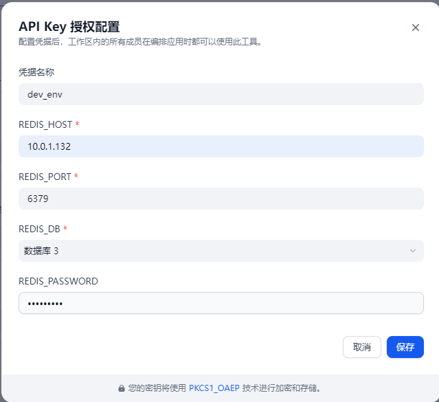
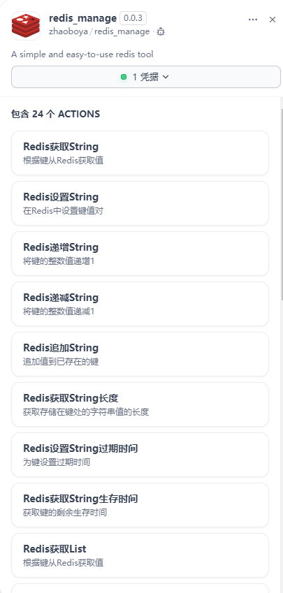
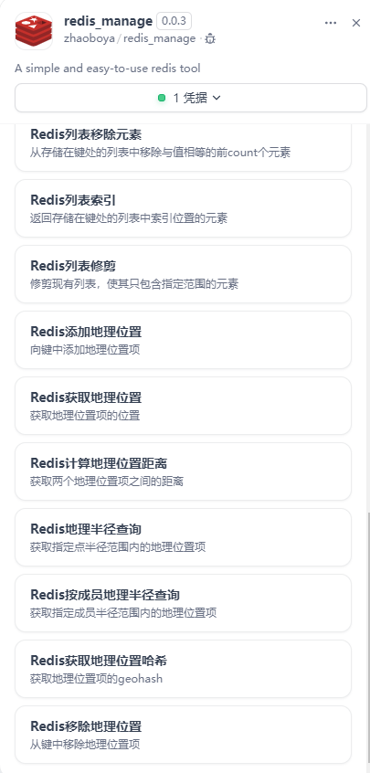

# Redis Manage 插件

**作者:** byzhao  
**版本:** 0.0.3  
**类型:** 工具  

## 描述

一个全面的 Redis 管理插件，为 Dify 提供跨多种 Redis 数据结构的广泛操作。该插件实现了与 Redis 数据库的无缝集成，在 Dify 工作流中提供高效的数据管理操作。

  
  
  

[English](README.md) | [中文](README_CN.md)

## 功能特性

- **多数据结构支持**: 对字符串(String)、列表(List)和地理空间(Geospatial)数据类型提供全面操作
- **安全连接**: 支持身份验证的可配置 Redis 连接
- **灵活配置**: 支持多个 Redis 数据库，可自定义主机、端口和身份验证
- **Dify 集成**: 与 Dify 的 AI 工作流和工具无缝集成

## 配置要求

插件需要以下凭据以连接 Redis:

- **REDIS_HOST**: Redis 服务器主机名或 IP 地址
- **REDIS_PORT**: Redis 服务器端口 (默认: 6379)
- **REDIS_DB**: Redis 数据库选择 (0-15)
- **REDIS_PASSWORD**: Redis 服务器密码 (可选，如果需要身份验证)

## 工具列表

此 Redis 插件提供按 Redis 数据结构组织的全面工具套件：

### 字符串操作 (String Operations)

用于键值存储和操作的字符串数据类型操作:

- **redis_string_set**: 在 Redis 中设置键值对，支持可选的过期时间
- **redis_string_get**: 从 Redis 中检索指定键的值
- **redis_string_incr**: 将键的数值加一
- **redis_string_decr**: 将键的数值减一
- **redis_string_append**: 向现有字符串键追加值
- **redis_string_strlen**: 获取存储在键中的值的长度
- **redis_string_expire**: 为键设置过期时间(TTL)
- **redis_string_ttl**: 获取键的剩余生存时间

### 列表操作 (List Operations)

用于有序值集合的列表数据类型操作:

- **redis_list_get**: 在指定范围内从列表中检索元素
- **redis_list_lpush**: 在列表头部插入一个或多个值
- **redis_list_rpush**: 在列表尾部插入一个或多个值
- **redis_list_lpop**: 移除并返回列表的第一个元素
- **redis_list_rpop**: 移除并返回列表的最后一个元素
- **redis_list_lindex**: 通过索引获取列表中的元素
- **redis_list_llen**: 获取列表长度
- **redis_list_lrem**: 移除列表中与指定值匹配的元素
- **redis_list_ltrim**: 将列表修剪为指定范围

### 地理空间操作 (Geospatial Operations)

基于位置数据的地理空间数据类型操作:

- **redis_geo_add**: 向键添加地理空间项目(经度、纬度、成员)
- **redis_geo_dist**: 计算两个地理空间成员之间的距离
- **redis_geo_hash**: 获取一个或多个成员的 Geohash 表示
- **redis_geo_pos**: 获取地理空间成员的经度和纬度
- **redis_geo_radius**: 在指定半径内从坐标查找成员
- **redis_geo_radius_by_member**: 从成员位置的半径内查找成员
- **redis_geo_rem**: 从键中移除地理空间成员

## 架构与设计

该插件遵循 Dify 插件架构标准:

- **模块化设计**: 每个 Redis 操作实现为单独的工具
- **通用工具**: 在 `utils/redis_client.py` 中共享 Redis 客户端功能
- **配置管理**: 在提供者 YAML 文件中集中管理工具配置
- **错误处理**: 在所有操作中提供全面的错误处理和验证

## 支持的 Redis 数据类型

插件当前支持以下 Redis 数据类型:

- **字符串(String)**: 带 TTL 支持的基本键值操作
- **列表(List)**: 带有推入/弹出功能的有序集合操作
- **地理空间(Geospatial)**: 带半径查询的位置基础操作

*注意: 未来版本将包括对哈希(Hash)、集合(Set)和有序集合(Sorted Set)数据类型的支持。*

## 使用场景

- **缓存解决方案**: 在 Dify 工作流中实现缓存层
- **会话管理**: 存储和管理用户会话数据
- **地理位置服务**: 处理基于位置的查询和操作
- **实时数据处理**: 处理和存储实时数据流
- **任务队列**: 实现基于队列的任务管理系统

## 技术规格

- **运行时**: Python 3.12
- **依赖项**: 详见 [requirements.txt](requirements.txt)

## 安全考虑

- 所有 Redis 连接支持密码身份验证
- 凭据通过 Dify 的凭据系统安全管理
- 网络通信遵循 Redis 安全最佳实践

## 未来增强

- **哈希操作**: 添加对 Redis 哈希数据类型操作的支持
- **集合操作**: 实现 Redis 集合数据类型操作
- **有序集合操作**: 添加 Redis 有序集合(ZSet)操作
- **高级功能**: 添加发布/订阅、事务和管道操作